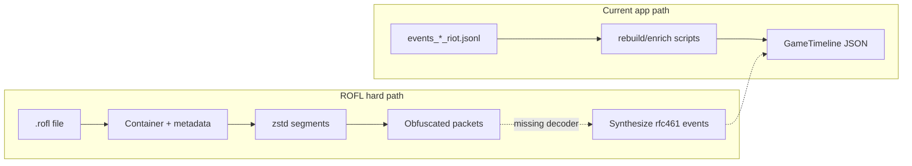
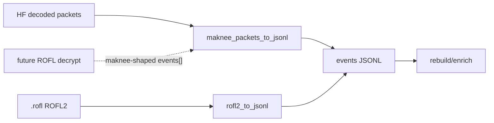

# League of Legends `.rofl` format — investigation notes

Status: **hard-path research**, grounded in local ROFL2 files + public community docs.  
Last verified: 2026-07-21 against:

- `~/Documents/League of Legends/Replays/BR1-3263797356.rofl` (patch `16.14.794.5912`)
- `~/Documents/League of Legends/Replays/BR1-3258889432.rofl` (patch `16.13.791.5903`)

This document is the repo’s fluency reference for a future `.rofl → events_*_riot.jsonl` pipeline. It separates what we can already extract from what remains blocked.

---

## 1. Executive summary

| Layer | What it is | Difficulty | Status in this repo |
|-------|------------|------------|---------------------|
| **A. Container** | File framing, metadata JSON, segment list | Medium | **Understood for ROFL2** (and documented for classic ROFL1) |
| **B. Segment bodies** | Decompressed chunk/keyframe blobs | Medium (ROFL2: zstd + dict) | **Extractable** (`scripts/rofl2_probe.py`) |
| **C. Packet decode** | Spectator/game packets inside those blobs | Very hard / patch-fragile | **Partial** — plaintext timestamps + cadence locked; field payloads still opaque (`scripts/rofl2_packet_taxonomy.py`) |
| **D. JSONL synthesis** | Map decoded state → `rfc461Schema` live-stats events | Medium *after* C | **Pipeline ready** from decoded packets (`maknee_packets_to_jsonl`); ROFL scaffold still placeholders |

**Critical distinction:** this app’s timeline path consumes Riot **live-stats** NDJSON (`events_*_riot.jsonl`, `rfc461Schema`, especially `stats_update`). A `.rofl` is a **spectator chunk dump**, not that feed. Even after perfect container parse, you do **not** get `stats_update` lines — you get encrypted/obfuscated binary packets that the League client understands.



---

## 2. Two container generations

Riot changed the on-disk format around patch **14.9 → 14.11**:

| | **ROFL1** (pre-14.9) | **ROFL2** (14.11+, current) |
|--|----------------------|------------------------------|
| Magic | `RIOT\x00\x00` | `RIOT\x02\x00` |
| Signature | 256-byte blob in 288-byte BIN header | 8 unknown bytes after magic (not the old 256-byte sig) |
| Metadata | JSON **after** BIN header (mid-file) | JSON **at EOF**; last 4 bytes = metadata length (`u32` LE) |
| Game version | Inside metadata JSON | **Near file start** (length-prefixed ASCII); often absent from trailing JSON |
| Payload crypto | Blowfish-ECB + gzip (key wrapped with gameId string) | **No Blowfish key in header**; zstd frames (+ dict) |
| Community parsers | `roflxd` / classic docs | `Rofl2Reader` in [fraxiinus/roflxd.cs](https://github.com/fraxiinus/roflxd.cs) — **metadata only**, no payload |

Both local replays are **ROFL2**. The rest of the deep dive focuses there; ROFL1 is summarized for contrast.

---

## 3. ROFL2 file layout (verified)

All multi-byte integers are **little-endian**. Strings are **not** NUL-terminated.

```
offset 0
├── magic[6]              "RIOT" + 0x02 0x00
├── unk8[8]               unknown (per-file); not classic signature
├── ver_len[1]            e.g. 0x0E = 14
├── version[ver_len]      ASCII patch build, e.g. "16.14.794.5912"
├── hdr_u32[4]            four u32 fields (meanings below — partial)
├── pad[1]                observed 0x00 before first zstd magic
├── PAYLOAD …             until metadata
│   ├── zstd frame 0      dictionary (decompress WITHOUT dict)
│   ├── preamble[34]      fixed-ish section intro (see §5)
│   └── repeated:
│         segment_hdr[17] + zstd frame (WITH dict from frame 0)
└── METADATA
    ├── json[N]           {"gameLength", "lastGameChunkId", "lastKeyFrameId", "statsJson"}
    └── N as u32          last 4 bytes of file
```

### 3.1 Locating metadata (Riot’s own note)

As of 14.11 (Riot engineer “Ridley”, via ReplayBook #299):

> We’ve added the metadata to the end of the file, the final 4 bytes of the file is the size of the JSON. We didn’t keep the game version in that metadata but it can be gotten from near the start of the file.

Verified:

```text
meta_len = u32(file[-4:])
meta_json = file[-(4+meta_len):-4]
```

### 3.2 Header `u32` quartet (after version)

Observed pattern on both samples: `(1, 2, A, B)`.

| Field | Sample (3263797356) | Sample (3258889432) | Notes |
|-------|---------------------|---------------------|-------|
| u32[0] | 1 | 1 | Constant so far |
| u32[1] | 2 | 2 | Constant so far |
| u32[2] | 3341571 | 5882115 | Large; correlates loosely with dict/content sizing — **not fully identified** |
| u32[3] | 1287936 | 1962240 | Large; **not** equal to first-frame compressed size |

Do not treat these as chunk counts; counts live in trailing metadata / segment headers.

### 3.3 Trailing metadata JSON

Top-level keys (ROFL2):

```json
{
  "gameLength": 1973096,
  "lastGameChunkId": 68,
  "lastKeyFrameId": 33,
  "statsJson": "<stringified JSON array of 10 player objects>"
}
```

`statsJson` is an **end-of-game box score**, not a timeline. Useful fields per player (non-exhaustive):

- Identity: `RIOT_ID_GAME_NAME`, `RIOT_ID_TAG_LINE`, `PUUID`, `SKIN` (champion), `TEAM`, `TEAM_POSITION` / `INDIVIDUAL_POSITION`
- Combat totals: `CHAMPIONS_KILLED`, `NUM_DEATHS`, `ASSISTS`, `GOLD_EARNED`, `LEVEL`, damage breakdowns, `ITEM0`–`ITEM6`, `KEYSTONE_ID`, `WIN`
- Plus a large set of mission/challenge counters (noise for our pipeline)

This is enough to label a match; it is **not** enough for `GameTimeline` frames.

---

## 4. ROFL2 payload: zstd + dictionary (verified)

### 4.1 Frame 0 = compression dictionary

1. First payload object is a standard **zstd** frame (`28 B5 2F FD`).
2. Decompress it with a normal zstd decompressor (**no** dictionary).
3. Treat the uncompressed bytes as a `ZstdCompressionDict` for all later frames.

Without that dict, later frames parse as zstd headers but fail with `Unknown frame descriptor` / decompress errors. With the dict, **all** subsequent frames inflate cleanly.

| File | Dict uncompressed | Data frames OK | Total uncompressed payload |
|------|-------------------|----------------|----------------------------|
| BR1-3263797356 | 13 053 B | 99 | ~42.4 MB |
| BR1-3258889432 | 22 977 B | 59 | ~22.5 MB |

`dict_id` in frame headers is **0**; the dict is supplied out-of-band (frame 0), not via zstd dict IDs.

### 4.2 Why “search for zstd magic” is wrong

Compressed block payloads can contain the bytes `28 B5 2F FD`. Counting magics over-counts and mis-bounds frames. **Walk frames by parsing zstd block headers** (3-byte block header → size → next), or use a decompressor that reports consumed input.

### 4.3 17-byte segment headers (verified)

After a **34-byte preamble**, the payload is a sequence of:

```text
segment_hdr[17] || zstd_frame[comp]
```

Segment header layout (confirmed: `unc`/`comp` match decompressed/compressed sizes 100% on both files):

| Offset | Type | Role |
|--------|------|------|
| 0 | `u32` | Segment id `a` |
| 4 | `u32` | Related id `b` (often `a+1` for chunks; keyframe pairing differs) |
| 8 | `u8` | **Type**: `1` = chunk, `2` = keyframe |
| 9 | `u32` | Uncompressed size |
| 13 | `u32` | Compressed zstd frame size |

Evidence:

| File | type=1 (chunk) | type=2 (keyframe) | `lastGameChunkId` | `lastKeyFrameId` |
|------|----------------|-------------------|-------------------|------------------|
| 3263797356 | 66 | **33** | 68 | **33** |
| 3258889432 | 39 | **20** | 41 | **20** |

Keyframe counts match metadata exactly. Chunk counts are slightly below `lastGameChunkId` (loading/startup chunks likely accounted differently — see preamble).

### 4.4 34-byte preamble (partially identified)

Identical prefix on both files:

```text
02 00 00 00  03 00 00 00  04 11 00 00  00 00 00 00
01 00 00 00  00 02 00 00  00 <u16/u32 varies> ...
```

Then the first 17-byte segment header (usually the first keyframe). Full semantics of the preamble are **TBD**; treat as “payload section intro” for now.

---

## 5. Packet layer (partially cracked)

After zstd+dict inflate, bodies are **not** uniform ciphertext. Median entropy is high (~7.0) but keyframes contain large **low-entropy structured regions**, and **every segment exposes a plaintext game time**.

### 5.1 Body time header (verified on 16.13 + 16.14)

```
offset 0: u8  marker   (keyframes: always 1; chunks: 1 or 2)
offset 1: f32 time_seconds   // LE float, plaintext
```

Keyframes then continue:

```
offset 5: u32 = 2
offset 9: u32 = 0x50 (80)
offset 13+: opaque / structured payload
```

Observed cadences on `BR1-3263797356`:

| Kind | Count with valid time | Δt mode | t range |
|------|----------------------|---------|---------|
| keyframe | 33 | **~60.0 s** | 0 … 1920.6 |
| chunk | 66 | **~30.0 s** | 0 … 1950.7 |

This matches classic spectator design (keyframes ~1/min, chunks ~30s) and the 2014 leaguespec header idea (`marker + float seconds`), with updated constants (`0x01` instead of `0x03`, etc.).

Tooling: `scripts/rofl2_packet_taxonomy.py` prints/writes the full segment timeline.

### 5.2 Early keyframe structure (observed, not fully decoded)

Near the start of keyframes (after the time header), a repeating slot pattern appears:

- Six-byte runs of `0x29`
- Neighboring context bytes that are **stable within a keyframe** and **change across keyframes**
- Slot offsets near `32 / 92 / 152 / 212` (≈60-byte stride) on sampled frames

Treat this as evidence of structured records, not as a finished schema.

### 5.3 Still blocked (live state)

Segment interiors are **not** yet yielding:

- JSON / `stats_update`-equivalent live fields
- reliable plaintext `position.{x,z}` / HP / item streams over time

End-of-game box-score integers from trailing `statsJson` do **not** appear as raw little-endian `u32` in keyframe bodies.

**Promising internal framing (verified 16.14):** keyframes contain long runs of

```
f1 00 | u16 length | payload[length]
```

The dominant pattern is **length = 8** with payload `a8 …` (12 bytes on the wire including the `f1` header). Contiguous runs cluster into **exactly 10 player groups**, each:

| Piece | Size | Notes |
|-------|------|--------|
| Opaque blob | ~2.0–2.4 KB | Between groups; candidate per-player state |
| a8 runs | `[1, 117, 117, 64, 24, 6]` = **329 rows** | Stable across mid-game keyframes |

`byte1` of each `a8` row only takes a handful of flag values (`0x28–0x2e`); `byte2` is almost always `0xb4`. End-of-game gold / HP / map floats do **not** appear as plaintext (or single-byte XOR) in blobs or rows.

**Implication:** static field decode is blocked. Community high-fidelity path (maknee 2025) runs League packet accessors under an emulator so values decrypt on read. Public decoded packets: [maknee/league-of-legends-decoded-replay-packets](https://huggingface.co/datasets/maknee/league-of-legends-decoded-replay-packets) (`WaypointGroup`, `Replication`, …). Downstream mapper in-repo: `scripts/maknee_packets_to_jsonl.py`. Structure probe: `scripts/rofl2_a8_structure.py`.

**Implication for JSONL:** `scripts/rofl2_to_jsonl.py` can emit roster + timed keyframe skeletons + final box score. Live map positions remain fountain placeholders until an emulator (or equivalent) decrypts these tables.

---

## 6. Classic ROFL1 (pre-14.9) — summary

Documented by [robertabcd/lol-ob](https://github.com/robertabcd/lol-ob/wiki/ROFL-Container-Notes), [Ayowel/lolrofl-rs ROFLFormat.adoc](https://github.com/Ayowel/lolrofl-rs/blob/master/ROFLFormat.adoc), and implemented in `RoflReader` (roflxd.cs).

```
BIN header 288 bytes
  magic RIOT\0\0 | signature 256 | length fields 26
JSON metadata (mid-file)
Payload header
  gameId u64 | gameLength | keyframe/chunk counts | startup ids |
  keyframeInterval | encKeyLen u16 | encKey (base64 string)
Segment headers 17 bytes × (chunks+keyframes)
Encrypted segment blobs …
```

**Decryption (ROFL1 only):**

1. `raw_key = base64_decode(encKey)`
2. `chunk_key = Blowfish-ECB_decrypt(key=ascii(gameId), data=raw_key)` + PKCS#5 unpad  
3. `zipped = Blowfish-ECB_decrypt(key=chunk_key, data=segment)` + unpad  
4. `payload = gzip_decompress(zipped)`

Inner content after that is still the obfuscated packet stream (same layer C problem).

ROFL1 mid-file metadata often included `gameVersion` inside JSON; ROFL2 moved version to the file head and metadata to the trailer.

---

## 7. Relationship to this repo’s JSONL / timeline

| | Live-stats JSONL | Decoded packets (maknee) | ROFL2 raw |
|--|------------------|---------------------------|-----------|
| Source | Esports event bus | HF / future ROFL decrypt | Client replay file |
| Cadence | ~1 Hz `stats_update` | Sampled `--hz` (default 1) | Keyframe ~60s scaffold |
| Positions / HP / items | Yes | Yes (WaypointGroup + Replication) | Placeholder until decrypt |
| Used by | rebuild / enrich / validate | same, via mapper | scaffold only today |

**Pipeline-first status:** decoded packets → canonical rfc461 is implemented. Raw `.rofl` still cannot supply live positions without an emulator decrypt. Shared emitters live in [`scripts/rfc461_emit.py`](../scripts/rfc461_emit.py). Every replay-derived stream now carries `rofl_coverage.provenance`; every participant position carries an explicit `positionSource`.



### Packet → rfc461 map (maknee mapper)

| Packet | JSONL |
|--------|--------|
| `CreateHero` | `game_info` roster (waypoint ids 1..10) |
| `WaypointGroup` / `WithSpeed` | `position` on `stats_update` |
| `Replication` (`mHP`, `mMaxHP`, `mLevelRef`, `mGoldTotal`) | HP / level / gold |
| `BuyItem` / `RemoveItem` / `SwapItem` | `items[]` |
| `CastSpellAns` | `skill_used` |
| `NPCDie*` on hero net_id | `champion_kill` |
| `NPCDie*` on turret / epic neutral | `building_destroyed` / `epic_monster_kill` |

The old FUR vs G2 sample (`events_2970115_1_riot.jsonl`) is a live-stats feed and is **unrelated** to the BR1 solo-queue `.rofl` files. Rebuild, enrich, and validation scripts now take explicit `--jsonl`, `--timeline`, and optional output paths; they do not depend on that Desktop path.

Minimum `stats_update` shape the rebuild path cares about (abbreviated):

```json
{
  "rfc461Schema": "stats_update",
  "gameTime": 144,
  "participants": [
    {
      "participantID": 1,
      "teamID": 100,
      "championName": "Ambessa",
      "playerName": "FUR Guigo",
      "level": 1,
      "alive": true,
      "health": 630,
      "healthMax": 630,
      "position": {"x": 603, "z": 611},
      "positionSource": "live_stats_position",
      "items": [{"itemID": 1222}],
      "ability1Level": 0,
      "ability2Level": 0,
      "ability3Level": 0,
      "ability4Level": 0
    }
  ]
}
```

Plus event schemas used in scripts: `game_info`, `building_destroyed`, `champion_kill`, `epic_monster_kill`, `ward_placed` / `ward_killed`, `role_bound_quest_completed`, etc.

---

## 8. Practical extractions we can do now

1. **Detect ROFL1 vs ROFL2** via 6-byte magic.
2. **Read patch version** from ROFL2 head.
3. **Parse trailing metadata** + `statsJson` → roster, KDA, items, win/loss.
4. **Inflate all chunk/keyframe bodies** (zstd + dict) via `scripts/rofl2_probe.py`.
5. **Index segments** (id, type, sizes) + **plaintext game times** via `scripts/rofl2_packet_taxonomy.py`.
6. **Emit ROFL scaffold JSONL** via `scripts/rofl2_to_jsonl.py` (fountain placeholders).
7. **Emit live-position JSONL from decoded packets** via `scripts/maknee_packets_to_jsonl.py`.
8. **Fixture smoke** via `scripts/rofl_maknee_fixture.py` / `npm run rofl:fixture`.
9. **Official Replay API** via `scripts/rofl_replay_api_probe.py` / `rofl_replay_api_to_jsonl.py` (`npm run rofl:replay-api`, `npm run rofl:replay-jsonl`) — playback access + focus coordinates + bounded rfc461 JSONL with unknown-HP semantics (live pilot evidence deferred when replay is closed).

```bash
python3 scripts/rofl2_probe.py \
  "$HOME/Documents/League of Legends/Replays/BR1-3263797356.rofl" \
  --dump-dir /tmp/rofl2-out --json-out /tmp/rofl2-out/summary.json

python3 scripts/rofl2_packet_taxonomy.py /tmp/rofl2-out
# writes /tmp/rofl2-out/taxonomy.json  (segment timeline + cadence stats)

python3 scripts/rofl2_to_jsonl.py \
  "$HOME/Documents/League of Legends/Replays/BR1-3263797356.rofl" \
  -o "$HOME/Desktop/events_BR1-3263797356_rofl.jsonl"

# Decoded-packet path (positions + HP → timeline UI):
npm run rofl:fixture
# writes docs/rofl-research/fixtures/events_maknee_stub.jsonl
# and public/data/maknee_stub_timeline.json (Game Review → Match → Maknee stub)

python3 scripts/maknee_packets_to_jsonl.py \
  docs/rofl-research/fixtures/maknee_match_stub.json \
  -o /tmp/events_maknee.jsonl --hz 1

python3 scripts/jsonl_to_timeline.py /tmp/events_maknee.jsonl \
  -o public/data/maknee_stub_timeline.json

# Provenance, cadence, roster, coordinates, HP, and timeline consistency:
python3 scripts/validate-rofl-pipeline.py \
  --jsonl docs/rofl-research/fixtures/events_maknee_stub.jsonl \
  --timeline public/data/maknee_stub_timeline.json

# Generic enrichment paths (no Desktop/Projects assumptions):
python3 scripts/rebuild-timeline-scoreboard.py \
  --jsonl /path/to/events_riot.jsonl \
  --timeline /path/to/input_timeline.json \
  --output /path/to/output_timeline.json
python3 scripts/enrich-timeline-career.py \
  --jsonl /path/to/events_riot.jsonl \
  --timeline /path/to/input_timeline.json \
  --output /path/to/output_timeline.json
```

### JSONL coverage (current)

| Event | ROFL2 scaffold | Maknee mapper |
|-------|----------------|---------------|
| `rofl_coverage` | Yes | Yes |
| `game_info` | Roster from `statsJson` | From `CreateHero` |
| `stats_update` | ~60s keyframes; fountain positions | ~1 Hz; real waypoints + HP |
| `skill_used` / kills / buildings | No | Best-effort from packets |
| `game_end` | Yes | Yes |

Decrypt plug-in point: emit maknee-shaped `{"events":[...]}` from a future ROFL decryptor → existing `maknee_packets_to_jsonl.py` → rebuild path.

We **cannot** yet drive the full combat-ready map/timeline UI from a raw `.rofl`
alone. An active, build-matched playback can now produce a position-accurate
timeline, but HP, combat stats, and ability ranks still require packet decrypt or
another decoded feed.

### Provenance and safety gate

`rofl_coverage.provenance` is part of the canonical JSONL stream. It records the source kind, patch artifact, millisecond time contract, coordinate system and `+7500` centered-coordinate transform, HP coverage, roster mapping, and the explicit placeholder policy. The timeline builder copies it to `GameTimeline.provenance` and preserves `positionSource` on each unit frame. Canonical `gameTime` values remain integer milliseconds even for short streams; the validator includes a regression covering `1000` and `40000` ms.

The UI treats `fountain_placeholder` as non-live state: xH is disabled while any such unit is visible, and Map → Calculator is disabled when a selected unit has a placeholder position or the timeline declares `positionCoverage: none`. Timelines with `hpCoverage: none` (Replay API pilot) keep real positions but block Send/engage because HP, ability ranks, and combat stats are unavailable — never treat missing HP as dead or full.

`python3 scripts/validate-rofl-pipeline.py --require-live-positions ...` is the strict import gate. It intentionally rejects the raw ROFL2 scaffold and accepts only a decoded stream with no placeholder participant rows.

### Installed-client playback probe (verified 2026-07-21)

Both local samples are ROFL2: `16.14.794.5912` is 16,374,230 bytes and `16.13.791.5903` is 8,516,557 bytes. The ROFL2 probe extracts zstd/dictionary segments and plaintext keyframe times (the 16.14 sample reports 33 keyframes, 66 chunks, and a ~30 s chunk cadence), but no live packet fields.

The initial installed-client inspection found no running replay process, so it
correctly refused to invent state. A later active, exact-build playback exposed
the official loopback Replay API and proved timestamped positions. The remaining
boundary is narrower: active playback is sufficient for positions, while HP,
ability ranks, and combat stats still require patch-matched client
emulation/decryption or another decoded source.

### Official Replay API feasibility probe (playback access ≠ decryption)

**Honest scope:** `scripts/rofl_replay_api_probe.py` / `npm run rofl:replay-api` is a *playback-access* + **focus-mode coordinate primitive**. It does **not** decrypt ROFL payloads. `--capture-current` remains a **single diagnostic JSON** proof object. Bounded timeline ingest uses `scripts/rofl_replay_api_to_jsonl.py` / `npm run rofl:replay-jsonl`, which emits the **existing rfc461 JSONL** shape with honest unknown-HP semantics (`health`/`healthMax` omitted; `hpCoverage: none`). No third interchange format.

Verified on 2026-07-21 for `BR1-3263797356.rofl` (`16.14.794.5912`) vs installed `LeagueofLegends.app` (exact normalized build match). OpenAPI includes `/replay/game`, `/replay/playback`, `/replay/render`, `/replay/sequence`, and liveclientdata. Render schema lists `selectionName`, `selectionOffset`, `cameraAttached`, `cameraPosition`, `cameraMode`.

| Concern | Status |
|---------|--------|
| ROFL ↔ client build match | Exact |
| Selection acceptance | **PROVEN** — `Gnar`→`ltetol`, `Samira`→`aizen cifer` (champion → Riot ID) |
| **Champion coordinates** | **PROVEN in `cameraMode=focus`** at paused `playback.time≈121.83765411376953` with identity-valid selection + `cameraAttached` + zero offset: distinct per-player `cameraPosition`; reselect repeats. Full 10-player capture requires player-identity keys (9/10 with spaced display names alone due to Tahm Kench stale retain) |
| Selection key policy | **Primary: plain Riot game name (`playerName`)** from `/liveclientdata/playerlist`; patch 16.14 live evidence showed the tagged Riot ID can be rejected while the plain name succeeds. Fallbacks: tagged `summonerName`, then champion **internal** name (`TahmKench`). Spaced display names (`Tahm Kench`) are invalid — may silently retain the previous selection with a duplicate finite cameraPosition |
| Top camera mode | **NOT proof** — selection may canonicalize while `cameraPosition` stays unchanged |
| `positionCoverage` | `replay_api_focus_selection` only after focus + canonical nonempty + finite position; else `none` |
| `hpCoverage` (capture) | Always `none` — Replay API has no participant HP feed for this path |
| Auto-edit `game.cfg` | **Never** |

**Enable Replay API (manual only):**

```cfg
[General]
EnableReplayApi=1
```

Typical macOS path: `/Applications/League of Legends.app/Contents/LoL/Config/game.cfg`. Restart the replay after editing. This repo never writes `game.cfg`.

```bash
# Status (offline-safe when :2999 closed → apiReachable false, exit 0)
npm run rofl:replay-api -- \
  --rofl "$HOME/Documents/League of Legends/Replays/BR1-3263797356.rofl"

# Focus-mode one-champion probe (no seek / no unpause; restore or exit 3)
npm run rofl:replay-api -- \
  --rofl "$HOME/Documents/League of Legends/Replays/BR1-3263797356.rofl" \
  --probe-selection Gnar

# Diagnostic capture at current paused timestamp (NOT timeline JSONL)
npm run rofl:replay-api -- \
  --rofl "$HOME/Documents/League of Legends/Replays/BR1-3263797356.rofl" \
  --capture-current --capture-out /tmp/replay_focus_capture.json

python3 -m unittest scripts.tests.test_rofl_replay_api_probe
```

**Safe focus method (probe + capture):** snapshot playback/render → for `--capture-current`, **require already `paused=true` and `seeking=false`** (fail without changing playback if not) → single `cameraMode=focus` → per roster member select by **plain player identity first** (tagged identity and champion internal-name fallbacks; strip `game_character_displayname_` prefixes) → attach + zero offset → GET. Invalid if canonical identity does not match. Legitimate champion overlap is allowed; the stale-render gate rejects the unsupported case where every identity-proven selection returns one coordinate. **Restore** posts `paused`/`speed` only (**never `time`**), then GET-verifies seeking/time/paused/speed and supported render fields — HTTP 200 alone is not enough (exit 3 if restore fails).

**Capture JSON:** one object with `gameTimeMs`, `roster`, per-participant `participantID`/`teamID`/`championName`/`playerName`/`level`/`items`/`alive`/`position{x,z}` / `positionSource:"replay_api_focus_selection"`, top-level `positionCoverage` + `hpCoverage:"none"`, and provenance stating it is **proof/capture data only**. Prefer `rofl:replay-jsonl` for ingestible rfc461.

### Replay API → rfc461 JSONL (bounded seek pilot)

`scripts/rofl_replay_api_to_jsonl.py` / `npm run rofl:replay-jsonl` seeks `[--start-ms, --end-ms]` at `--step-ms` (default 1000), captures all 10 positions via the focus/player-identity primitive, and writes canonical rfc461 JSONL only:

| Field | Contract |
|-------|----------|
| Schemas | `rofl_coverage` → `game_info` → `stats_update` per sample (integer ms) |
| Positions | Real; `positionSource: replay_api_focus_selection` |
| HP | **Omitted**; `healthSource` / `combatStatsSource` / `abilityRanksSource` = `unavailable_replay_api` |
| Provenance | `source: replay_api_playback`, `positionCoverage: full_at_sampled_frames`, `hpCoverage: none` |
| Seek | Allowed here — pause, POST time, poll `seeking=false` + time tolerance; **re-assert `cameraMode=focus` after every seek**; two-phase restore seeks the initial time while paused, proves it, then restores speed/paused state. Patch 16.14 ignores free `cameraPosition` writes in running top mode, so that one field is best-effort only when playback started running; stable render fields remain strict |
| Liveclient | Stable identity→participantID once; **after each settled seek** poll until `gameData.gameTime` matches target (bounded tol/timeout) with complete identities, then merge level/items/alive; never reuse initial/stale dynamics |
| Durability | Headers are written once; every completed `stats_update` is flushed + fsynced immediately. `--resume` strictly validates provenance/build/schedule/roster and appends only a contiguous missing suffix |
| Roles | Preserve Riot liveclient `position` (TOP/JUNGLE/MIDDLE/BOTTOM/UTILITY) → Timeline Top/Jungle/Middle/Bottom/Support in `game_info` + stats rows |
| Build | Exact ROFL↔client match required unless `--allow-build-mismatch` |
| UI | `GameTimeline` sets `hpKnown`/`combatStatsKnown`/`abilityRanksKnown=false`; GameReview can open a generated timeline with **Open timeline JSON** and blocks Send/engage with copy that positions are real but HP/ability/combat state is unavailable |

```bash
# Offline mocked tests (no League)
python3 -m unittest scripts.tests.test_rofl_replay_api_to_jsonl scripts.tests.test_rofl_replay_api_probe

# Live pilot when a matching SR replay is open with Replay API enabled (deferred acceptance)
npm run rofl:replay-jsonl -- \
  --rofl "$HOME/Documents/League of Legends/Replays/BR1-3263797356.rofl" \
  --out /tmp/replay_api_121_124.jsonl \
  --start-ms 121000 --end-ms 124000 --step-ms 1000 \
  --checkpoint-out /tmp/replay_api_121_124.checkpoint.json

# Resume the same strict contract after interruption (no duplicate rows)
npm run rofl:replay-jsonl -- \
  --rofl "$HOME/Documents/League of Legends/Replays/BR1-3263797356.rofl" \
  --out /tmp/replay_api_121_124.jsonl \
  --start-ms 121000 --end-ms 124000 --step-ms 1000 \
  --checkpoint-out /tmp/replay_api_121_124.checkpoint.json --resume
npm run rofl:timeline -- /tmp/replay_api_121_124.jsonl -o /tmp/replay_api_121_124_timeline.json \
  --id replay_api_pilot --name "Replay API pilot 121-124s"
npm run rofl:validate -- --jsonl /tmp/replay_api_121_124.jsonl --timeline /tmp/replay_api_121_124_timeline.json --require-live-positions
```

**Live acceptance: PASS (2026-07-21).** Exact-build
`BR1-3264383283.rofl` (`16.14.794.5912`) produced three 1 Hz frames at
1121–1123 s: 30/30 real participant rows, three distinct frame signatures,
zero fountain placeholders, and no emitted HP fields. The canonical JSONL
converted to a three-frame `GameTimeline` and passed
`validate-rofl-pipeline.py --require-live-positions`. A separate live restore
gate returned `restoreSucceeded: true` with the replay running again. Reordering
selection keys from rejected tagged IDs to the proven plain game name reduced a
ten-player single-frame live gate from about 14.5 s to 2.15 s; treat that as an
indicative local benchmark, not a full-match SLA. `--resume` completed-output
no-op was also proven live without touching playback.

The subsequent full-match acceptance captured `BR1-3264383283.rofl` from
60,000 through 2,155,000 ms at native 1 Hz: 2,096 frames, 20,960 participant
rows, ten moving participants, zero fountain placeholders, and zero invented HP
samples. The ROFL2 metadata `gameLength=2,155,367` correctly clamps the Replay
API's padded `playback.length=2,161.333`; the last complete 1 Hz frame is
therefore 2,155,000 ms. The generated timeline was opened through Game Review's
local-file control and rendered without browser errors while preserving the
combat-state safety block. Offline replay suites are 53/53 green; TS build,
lint (three pre-existing unused-variable warnings), and strict full-pipeline
validation are green.

---

## 9. Hard-path roadmap (ordered)

1. ~~**Container tooling**~~ — `scripts/rofl2_probe.py`
2. ~~**Packet taxonomy (time + cadence)**~~ — `scripts/rofl2_packet_taxonomy.py`
3. ~~**JSONL scaffold**~~ — `scripts/rofl2_to_jsonl.py`
4. ~~**a8 / player-group structure**~~ — `scripts/rofl2_a8_structure.py`
5. ~~**Decoded-packets → rfc461 pipeline**~~ — `scripts/rfc461_emit.py`, `scripts/maknee_packets_to_jsonl.py`, `scripts/rofl_maknee_fixture.py`
6. ~~**Official Replay API feasibility probe**~~ — `scripts/rofl_replay_api_probe.py`
7. ~~**Focus-mode coordinate primitive**~~ — selection + focus coords proven; `--capture-current` diagnostic JSON
8. ~~**rfc461 unknown-HP + Replay API JSONL pilot**~~ — live exact-build positions → JSONL → `GameTimeline` proven
9. ~~**Crash-safe playback extraction**~~ — per-frame durable writes, strict `--resume`, two-phase state restore
10. **Field decrypt** (follow-on)  
   Client-emulator approach (maknee-style) against the matching patch binary.
11. **Semantic densify**  
   Point rebuild at maknee/ROFL-derived JSONL; validate map UI.
12. **Maintenance**  
   Pin patch version on every artifact; CI fixture smoke (`npm run rofl:fixture`).

Legal / ToS: unofficial reverse engineering of replay packets sits in a gray area Riot has historically discouraged (anti-cheat rationale). Treat as research; do not ship a cheat client. The official Replay API path is Riot-documented tooling (League Director reference) and is distinct from packet decryption.

---

## 10. References

- Riot metadata trailer note — [fraxiinus/ReplayBook#299](https://github.com/fraxiinus/ReplayBook/issues/299)
- ROFL2 metadata reader — [fraxiinus/roflxd.cs `Rofl2Reader.cs`](https://github.com/fraxiinus/roflxd.cs/blob/master/Rofl.Extract.Data/Readers/Rofl2Reader.cs)
- Classic container — [lol-ob ROFL Container Notes](https://github.com/robertabcd/lol-ob/wiki/ROFL-Container-Notes)
- Classic detailed layout — [Ayowel/lolrofl-rs `ROFLFormat.adoc`](https://github.com/Ayowel/lolrofl-rs/blob/master/ROFLFormat.adoc)
- Spectator REST / Blowfish era — [loldevs/leaguespec wiki](https://github.com/loldevs/leaguespec/wiki/REST-Service)
- Local probe outputs — [`docs/rofl-research/extract-summary.json`](rofl-research/extract-summary.json)
- Packet taxonomy sample — [`docs/rofl-research/taxonomy-BR1-3263797356.json`](rofl-research/taxonomy-BR1-3263797356.json)
- Scripts — [`scripts/rfc461_emit.py`](../scripts/rfc461_emit.py), [`scripts/rofl2_probe.py`](../scripts/rofl2_probe.py), [`scripts/rofl2_packet_taxonomy.py`](../scripts/rofl2_packet_taxonomy.py), [`scripts/rofl2_a8_structure.py`](../scripts/rofl2_a8_structure.py), [`scripts/rofl2_to_jsonl.py`](../scripts/rofl2_to_jsonl.py), [`scripts/maknee_packets_to_jsonl.py`](../scripts/maknee_packets_to_jsonl.py), [`scripts/rofl_maknee_fixture.py`](../scripts/rofl_maknee_fixture.py), [`scripts/rofl_replay_api_probe.py`](../scripts/rofl_replay_api_probe.py), [`scripts/rofl_replay_api_to_jsonl.py`](../scripts/rofl_replay_api_to_jsonl.py), [`scripts/jsonl_to_timeline.py`](../scripts/jsonl_to_timeline.py), [`scripts/validate-rofl-pipeline.py`](../scripts/validate-rofl-pipeline.py)
- Official Replay API / League Director — [Riot LoL docs (Replay API)](https://developer.riotgames.com/docs/lol), [RiotGames/leaguedirector](https://github.com/RiotGames/leaguedirector)
- Fixture — [`docs/rofl-research/fixtures/maknee_match_stub.json`](rofl-research/fixtures/maknee_match_stub.json)
- Decoded-packet research — [maknee 2025 write-up](https://maknee.github.io/blog/2025/League-Data-Scraping/), [HF decoded packets](https://huggingface.co/datasets/maknee/league-of-legends-decoded-replay-packets)

---

## 11. Local paths

| Artifact | Path |
|----------|------|
| Client replays folder | `~/Documents/League of Legends/Replays/` |
| Live-stats sample (app) | `~/Desktop/events_2970115_1_riot.jsonl` |
| Timeline output | `public/data/fur_vs_g2_timeline.json` |
| This doc | `docs/rofl-format.md` |
| Probe summary | `docs/rofl-research/extract-summary.json` |
